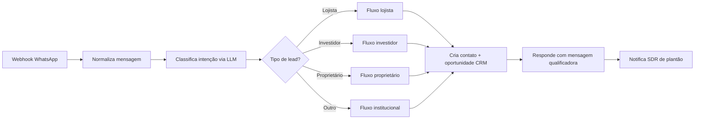

# Workflow: Qualifica Lead Inbound via WhatsApp

## 1. Objetivo
Capturar mensagens inbound no WhatsApp Business, identificar intenção (lojista, investidor, proprietário), responder automaticamente com saudação institucional, coletar dados básicos de qualificação BANT-C e registrar lead no CRM.

## 2. Gatilho
- **Tipo:** webhook
- **Detalhe:** endpoint configurado na WhatsApp Business API (`/webhooks/whatsapp/inbound`)
- **Frequência esperada:** 20 a 100 mensagens/dia

## 3. Pré-requisitos
- [ ] Credencial WhatsApp Business API (provedor oficial)
- [ ] Credencial OpenAI / Claude
- [ ] Credencial CRM (HubSpot/Pipedrive)
- [ ] Templates de mensagem aprovados no WhatsApp

## 4. Fluxo

## 5. Nós Principais
1. **Webhook In** — recebe payload da WhatsApp Business API.
2. **Set / Normalize** — extrai número, nome, mensagem.
3. **OpenAI / Claude — Classificação de Intenção** — usa prompt `/IA/Prompts/SDR/`.
4. **Switch — Tipo de Lead** — roteia para fluxo correto.
5. **HTTP Request — CRM** — cria/atualiza contato e oportunidade.
6. **WhatsApp — Send Template Message** — envia resposta qualificadora.
7. **Slack / WhatsApp — Notify SDR** — alerta plantão.

## 6. Tratamento de Erro
- **Estratégia:** 3 tentativas com backoff exponencial; falha cria task manual no CRM.
- **Notificação de falha:** Slack `#alertas-n8n` + WhatsApp on-call.
- **SLA de recuperação:** 5 minutos.

## 7. Logs
- **Onde:** Google Sheets `Logs Automações > whatsapp-inbound`.
- **O que registra:** timestamp, número, nome, classificação, ID criado no CRM.

## 8. Métricas
- Execuções/dia: 20 a 100
- Taxa de sucesso esperada: ≥ 99,5%
- Tempo médio: < 5 segundos

## 9. Plano de Disaster Recovery
- Backup do JSON: `/Automacoes/n8n/workflows/comercial-qualifica-lead-whatsapp.json`
- Em caso de falha do workflow: SDR de plantão monitora WhatsApp diretamente.

## 10. Histórico
| Versão | Data | Autor | Mudança |
|--------|------|-------|---------|
| 1.0.0 | 2026-05-16 | Planejarcomm | Versão inicial documentada |
