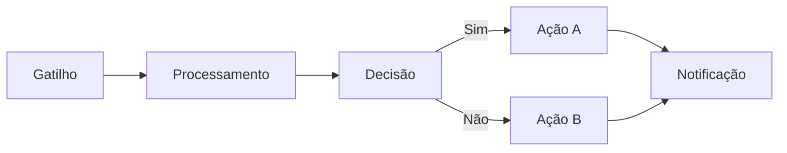

# Workflow: [Nome]

## 1. Objetivo
_(O que este workflow resolve em 1 parágrafo)_

## 2. Gatilho
- **Tipo:** _webhook | cron | manual | evento_
- **Detalhe:** _URL do webhook, expressão cron, evento de origem_
- **Frequência esperada:** _N execuções/dia_

## 3. Pré-requisitos
- [ ] Credencial X configurada no n8n
- [ ] Variável de ambiente Y definida
- [ ] Acesso a sistema Z autorizado

## 4. Fluxo

## 5. Nós Principais
1. **[Nome do Nó]** — _o que faz_
2. **[Nome do Nó]** — _o que faz_
3. **[Nome do Nó]** — _o que faz_

## 6. Tratamento de Erro
- **Estratégia:** retry exponencial / dead letter / alerta
- **Notificação de falha:** Slack `#alertas-n8n` + WhatsApp on-call
- **SLA de recuperação:** _N minutos_

## 7. Logs
- **Onde:** Google Sheets `[link]` / Notion `[link]`
- **O que registra:** timestamp, input, output, status

## 8. Métricas
- Execuções/dia: _média / pico_
- Taxa de sucesso esperada: _≥ 99%_
- Tempo médio de execução: _N segundos_

## 9. Plano de Disaster Recovery
- Backup do JSON: `/Automacoes/n8n/workflows/[nome].json`
- Procedimento de rollback documentado em: _link_

## 10. Histórico
| Versão | Data | Autor | Mudança |
|--------|------|-------|---------|
| 1.0.0 | YYYY-MM-DD | _ | Versão inicial |
