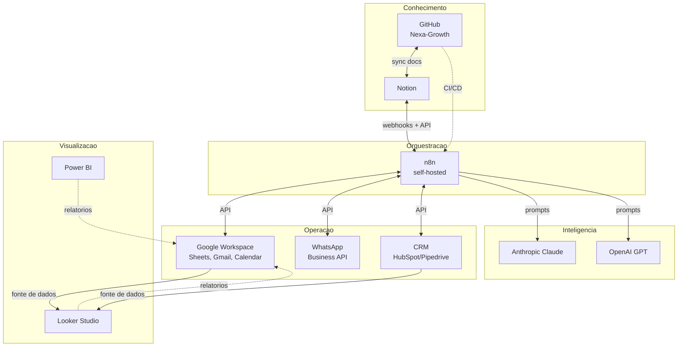

# Arquitetura de Integrações — Nexa-Growth

## 1. Visão Geral

O ecossistema digital Nexa Malls é composto por **5 camadas** integradas:

1. **Conhecimento** — GitHub (`Nexa-Growth`) + Notion
2. **Orquestração** — n8n
3. **Operação** — Google Workspace + WhatsApp Business API + CRM
4. **Inteligência** — Anthropic / OpenAI APIs
5. **Visualização** — Looker Studio + Power BI + Google Sheets

## 2. Diagrama Macro



## 3. Princípios Arquiteturais

1. **n8n como hub** — toda integração crítica passa por n8n para observabilidade.
2. **GitHub como source of truth de conhecimento** — Notion espelha, GitHub versiona.
3. **Sem ponto único de falha** — todo workflow crítico tem fallback humano.
4. **Logs centralizados** — Sheets/Notion + dashboards de monitoramento.
5. **Princípio de menor privilégio** — escopos mínimos em toda credencial.

## 4. Fluxos-Chave

### 4.1 Captura de Lead Inbound
```
Site / WhatsApp / LinkedIn → Webhook → n8n →
  classifica intenção (LLM) → cria contato no CRM →
  responde com template → notifica SDR de plantão →
  loga em Sheets
```

### 4.2 Publicação de Conteúdo
```
GitHub commit em /Marketing/Conteudo/ → 
  webhook → n8n → 
  valida com prompt de revisão → 
  cria página draft no Notion → 
  notifica time editorial
```

### 4.3 Estudo de Viabilidade
```
GitHub /Viabilidade/Templates/ → 
  preenchido manualmente por analista → 
  webhook on PR → 
  n8n executa prompt de crítica → 
  registra parecer no PR → 
  diretor financeiro revisa
```

## 5. Catálogo de Endpoints Internos

Ver `/APIs/Documentacao/`.

## 6. Catálogo de Workflows

Ver `/Automacoes/n8n/workflows/`.

## 7. Catálogo de Credenciais

Ver `/Automacoes/n8n/credenciais/`.

## 8. Próximos Marcos

- [ ] Provisionar n8n self-hosted produtivo
- [ ] Configurar WhatsApp Business API com provedor oficial
- [ ] Definir CRM oficial (HubSpot vs. Pipedrive)
- [ ] Implantar primeiro workflow produtivo end-to-end
- [ ] Dashboard de monitoramento de workflows
