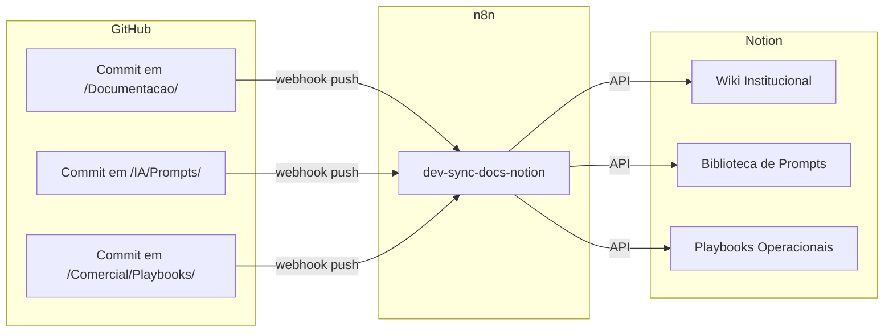

# Integração GitHub ↔ Notion

## 1. Objetivo
Manter Notion (knowledge hub dinâmico) e GitHub (`Nexa-Growth`, source of truth versionado) em sincronia para que o time tenha um único corpo de conhecimento, acessível por dois canais.

## 2. Princípios
1. **GitHub é a fonte autoritativa** para conhecimento estável.
2. **Notion é a camada de leitura e colaboração** para conhecimento dinâmico.
3. **Atas, tasks e projetos** nascem no Notion.
4. **Políticas, processos, prompts e templates** nascem no GitHub.
5. **Mudanças críticas** em qualquer um dos dois geram log no outro.

## 3. Fluxo

## 4. Mapeamento de Pastas

| GitHub | Notion (Página/Database) |
|--------|---------------------------|
| `/Documentacao/Politicas/` | Wiki > Políticas |
| `/Documentacao/Processos/` | Wiki > Processos |
| `/IA/Prompts/` | Database > Prompts |
| `/Comercial/Playbooks/` | Database > Playbooks |
| `/Projetos/` | Database > Projetos |

## 5. Convenções
- Páginas Notion espelhadas iniciam com tag `[sync]`.
- Edições humanas em páginas `[sync]` são reescritas pela próxima sincronização.
- Mudanças permanentes devem ser feitas no GitHub.

## 6. Ferramentas
- **Workflow n8n:** `dev-sync-docs-notion`
- **Frequência:** em cada push para `main`
- **Logs:** Google Sheets `Logs-Automacoes`
