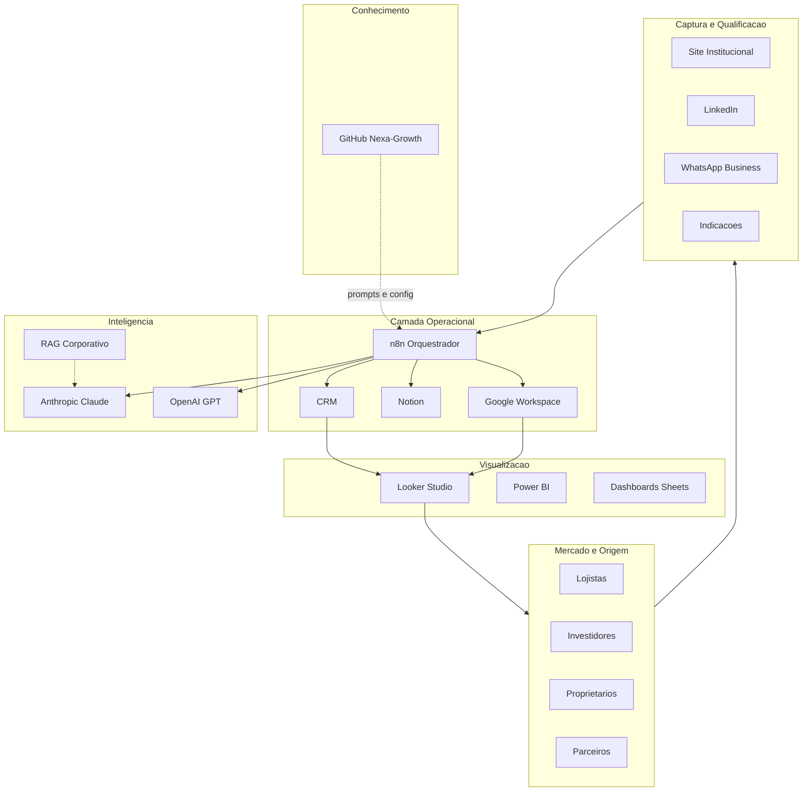
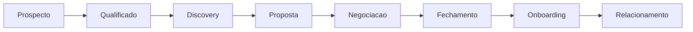
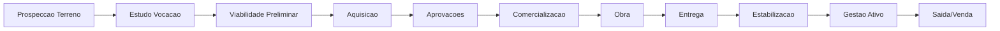

# Diagramas — Ecossistema Nexa-Growth

## Visão Macro

```mermaid
flowchart TB
  subgraph Mercado[Mercado e Origem]
    M1[Lojistas]
    M2[Investidores]
    M3[Proprietarios]
    M4[Parceiros]
  end

  subgraph Captura[Captura e Qualificacao]
    C1[Site Institucional]
    C2[LinkedIn]
    C3[WhatsApp Business]
    C4[Indicacoes]
  end

  subgraph Operacao[Camada Operacional]
    O1[n8n Orquestrador]
    O2[CRM]
    O3[Notion]
    O4[Google Workspace]
  end

  subgraph Inteligencia[Inteligencia]
    I1[Anthropic Claude]
    I2[OpenAI GPT]
    I3[RAG Corporativo]
  end

  subgraph Conhecimento[Conhecimento]
    K1[GitHub Nexa-Growth]
  end

  subgraph Visualizacao[Visualizacao]
    V1[Looker Studio]
    V2[Power BI]
    V3[Dashboards Sheets]
  end

  Mercado --> Captura
  Captura --> O1
  O1 --> O2
  O1 --> O3
  O1 --> O4
  O1 --> I1
  O1 --> I2
  I3 -.-> I1
  K1 -.->|prompts e config| O1
  O2 --> V1
  O4 --> V1
  V1 --> Mercado
```

## Funil Comercial Unificado

```mermaid
flowchart LR
  P[Prospecto] --> Q[Qualificado]
  Q --> D[Discovery]
  D --> PR[Proposta]
  PR --> N[Negociacao]
  N --> F[Fechamento]
  F --> O[Onboarding]
  O --> R[Relacionamento]
```

## Ciclo de Vida de um Projeto

```mermaid
flowchart LR
  PR[Prospeccao Terreno] --> EV[Estudo Vocacao]
  EV --> VP[Viabilidade Preliminar]
  VP --> AQ[Aquisicao]
  AQ --> AP[Aprovacoes]
  AP --> CO[Comercializacao]
  CO --> OB[Obra]
  OB --> EN[Entrega]
  EN --> ES[Estabilizacao]
  ES --> GA[Gestao Ativo]
  GA --> SA[Saida/Venda]
```
